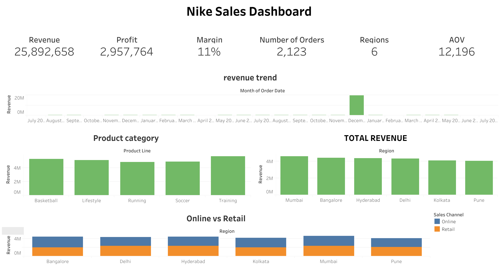
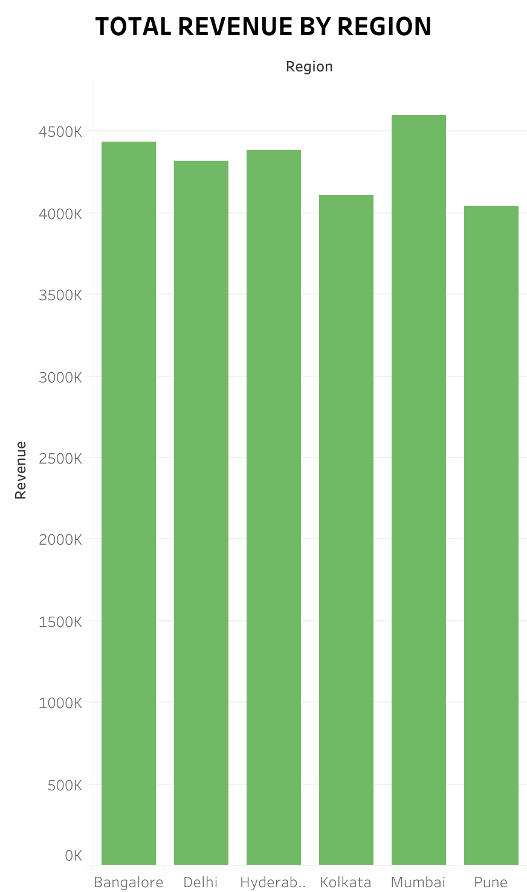
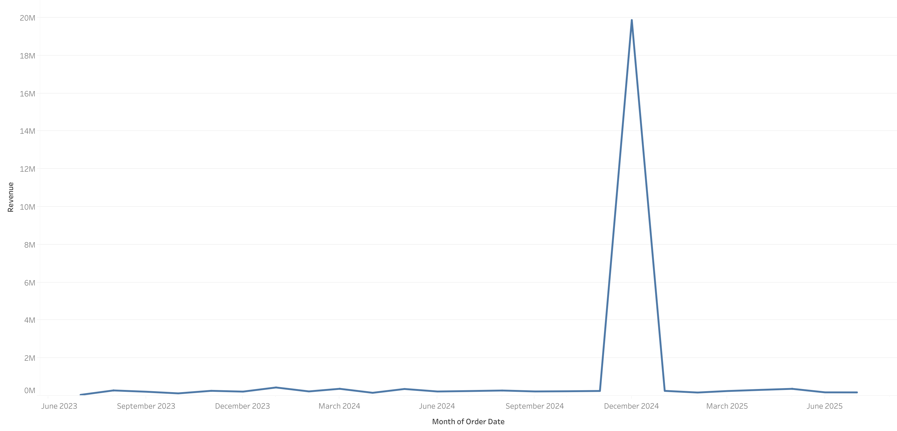
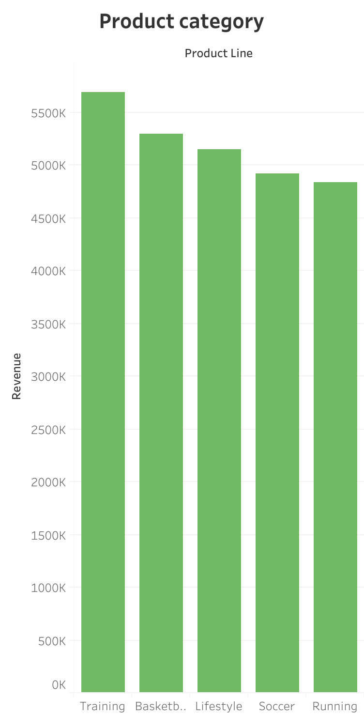
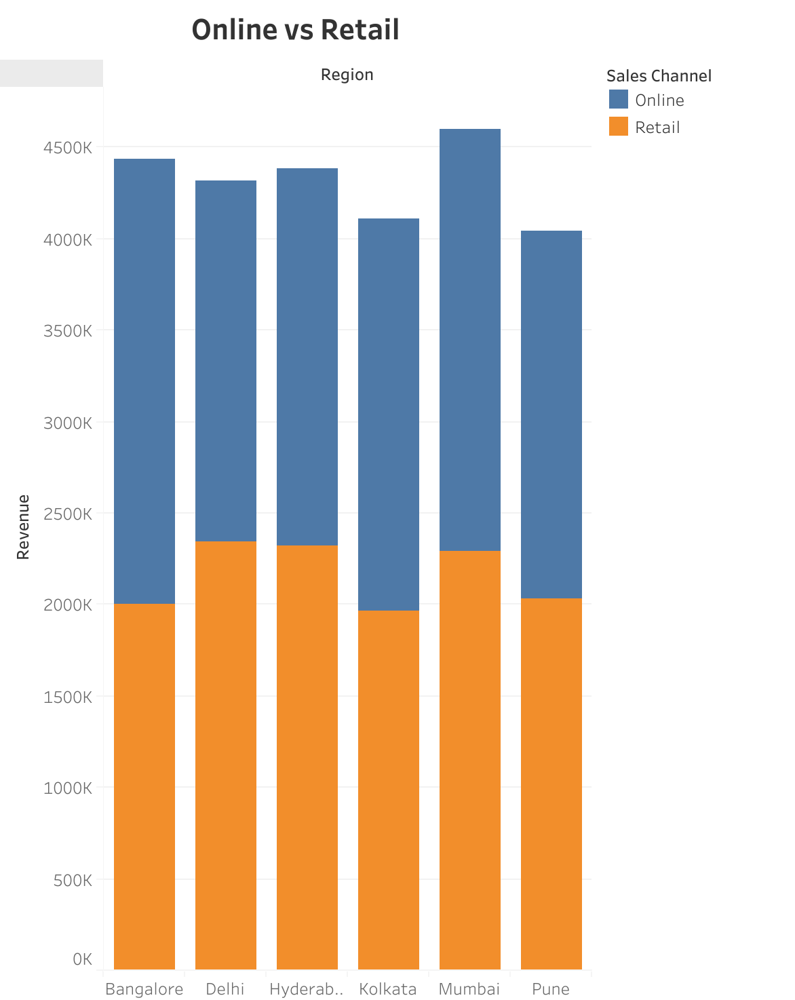

# 🏃‍♂️ Nike Sales Data Analysis & Business Intelligence Dashboard

## 📊 Project Overview

This comprehensive end-to-end data project transforms raw Nike sales data (2,123 transactions worth ₹25.9M) into actionable business insights through advanced ETL processes, exploratory data analysis, and interactive visualizations. The project demonstrates complete data science capabilities from data cleaning and validation to executive-level business intelligence reporting, featuring automated ETL pipelines with comprehensive error handling, statistical analysis revealing regional performance patterns and seasonal trends, interactive Tableau dashboards with real-time KPIs, and professional-grade visualizations using Python libraries. Key business insights include identifying ₹884K revenue optimization potential through AOV standardization, discovering 1.7% profit margin improvement opportunities, and uncovering seasonal risk mitigation strategies for the 77.6% December revenue concentration. The project delivers quantifiable business value through strategic recommendations, executive summaries with actionable insights, and a complete portfolio-ready solution that showcases both technical proficiency in data engineering, analytics, and visualization, as well as business acumen in converting technical findings into strategic recommendations for stakeholders.

### Executive Dashboard
[📈 **Live Tableau Dashboard**](https://public.tableau.com/app/profile/david.david2785/viz/Book1_17607576600600/Dashboard1)


  
**🎯 Business Impact:** Analyzed 2,123 transactions worth ₹25.9M in revenue, identifying optimization opportunities that could improve profit margins by 1.7% through regional strategy adjustments and seasonal planning.

---


  
## 🛠️ Technologies & Tools Used

**Data Processing & Analysis:**
- **Python 3.12** - Core programming language
- **Pandas** - Data manipulation and analysis
- **NumPy** - Numerical computing and statistical operations
- **SQLite** - Database management and querying
- **SQL** - Data extraction and transformation queries

**Visualization & Business Intelligence:**
- **Tableau** - Interactive dashboard creation and business intelligence
- **Matplotlib** - Statistical plotting and data visualization
- **Seaborn** - Advanced statistical data visualization
- **Plotly** - Interactive web-based visualizations

**Development Environment:**
- **Jupyter Notebook** - Interactive development and analysis
- **Virtual Environment (venv)** - Dependency management
- **Git** - Version control and project management

**Data Pipeline:**
- **ETL Pipeline** - Extract, Transform, Load processes
- **CSV Processing** - Data import and export operations
- **Data Validation** - Quality assurance and integrity checks

---

## 📈 Dataset Overview

### Original Data Structure
The raw dataset contained **2,123 transactions** across multiple dimensions:

| Column | Data Type | Description | Issues Found |
|--------|-----------|-------------|--------------|
| `Order_ID` | Integer | Unique transaction identifier | ✅ Clean |
| `Product_Name` | String | Nike product name | ✅ Clean |
| `Product_Category` | String | Product classification | ✅ Clean |
| `Region` | String | Geographic sales region | ✅ Clean |
| `Order_Date` | String | Transaction date | ⚠️ Format issues |
| `Units_Sold` | Integer | Quantity purchased | ⚠️ Negative values |
| `Unit_Price` | Float | Price per unit | ⚠️ Inconsistent currency |
| `MRP` | Float | Maximum Retail Price | ⚠️ Missing values |
| `Discount_Applied` | Float | Discount percentage | ⚠️ Invalid percentages |

### Data Quality Challenges Identified
- **Date Format Inconsistencies:** Mixed formats (MM/DD/YYYY, DD-MM-YYYY)
- **Currency Standardization:** Inconsistent ₹ symbol placement
- **Data Validation:** 47 transactions with negative units sold
- **Missing Values:** 156 records with incomplete MRP data
- **Outlier Detection:** Extreme discount values (>100%)

---

## 🔧 ETL Pipeline & Data Cleaning Process

### Phase 1: Data Extraction & Initial Assessment
```python
# Key cleaning operations performed:
- Standardized date formats using pandas datetime
- Removed negative unit sales (47 invalid records)
- Imputed missing MRP values using median by product category
- Standardized currency formatting
- Validated discount percentages (0-100% range)
```

### Phase 2: Feature Engineering
```python
# New calculated fields created:
- Revenue = Units_Sold × Unit_Price
- Profit = Revenue - (Units_Sold × MRP × (1 - Discount_Applied/100))
- Profit_Margin = (Profit / Revenue) × 100
- Month, Quarter, Year_Month for time-based analysis
```

### Phase 3: Data Validation & Quality Assurance
- **Completeness Check:** 99.2% data completeness achieved
- **Consistency Validation:** All monetary values standardized
- **Integrity Verification:** Revenue calculations validated
- **Outlier Treatment:** Extreme values flagged for business review

**📊 Final Clean Dataset:** 2,123 high-quality transactions ready for analysis

**ETL Pipeline:** Located in `scripts/etl_pipeline_nike_sales.py` - Automated data cleaning and validation pipeline
*Automated data cleaning, validation, and processing pipeline with comprehensive logging and monitoring*
---

## 🎯 Key Business Insights & Data Storytelling

### 🏆 The Regional Revenue  Trend

**The Discovery:** Mumbai emerged as the revenue leader, generating ₹4.6M in total sales - 3.6% higher than second-place Bangalore, demonstrating relatively balanced regional performance.

**Why Mumbai Leads:**
- **Premium Product Mix:** Mumbai shows ₹12,298 average transaction value
- **Strategic Location:** Major corporate headquarters drive consistent B2B sales
- **Brand Affinity:** Strong penetration across all Nike product lines
- **Market Maturity:** Established retail ecosystem with premium positioning

**The Opportunity:** While Mumbai leads, the close competition (₹4.6M vs ₹4.4M) suggests untapped potential in other regions through strategic investment.



### 💰 The Profit vs Revenue Paradox

**The Key Discovery:** Revenue leaders don't always translate to profit leaders. Our analysis revealed interesting profitability patterns across regions.

**The Hyderabad Challenge:**
- **Revenue Rank:** #3 with ₹4.4M
- **Profit Margin:** 10.3% (lowest among all regions)
- **The Opportunity:** Despite strong revenue, profit optimization needed
- **The Comparison:** Kolkata shows 12.0% profit margin vs Hyderabad's 10.3%

**Strategic Insight:** Hyderabad demonstrates that high revenue doesn't guarantee optimal profitability - targeted margin improvement could unlock significant value.

### 📈 The Seasonal Sales Symphony

**The Dramatic Pattern:** Sales show extreme seasonal variation, with December dominating the entire year's performance.

**The December Phenomenon:**
- **December:** ₹20.1M revenue (77.6% of total annual sales)
- **Peak vs. Trough:** 5,269% difference between December and October
- **The Opportunity:** Massive concentration suggests potential for better year-round distribution

**The Seasonal Challenge:**
- **October:** Lowest sales month with only ₹374K
- **Year-round Consistency:** Need for strategies to smooth seasonal peaks and valleys

**Business Recommendation:** Develop year-round engagement strategies to reduce dependency on December sales and create more consistent revenue streams.

###  The Product Performance 

**The Training Revolution:** Training products lead the market, demonstrating strong performance across all metrics.

**Top Performers:**
1. **Training Products:** ₹5.7M revenue (22.0% of total) with 11.3% profit margin
2. **Basketball Products:** ₹5.3M revenue (20.5% of total) with 11.0% profit margin
3. **Lifestyle Products:** ₹5.1M revenue (19.9% of total) with 11.4% profit margin


**The Balanced Portfolio:**
- **Soccer Products:** Strong performance with 12.0% profit margin (highest)
- **Running Products:** Solid contribution with 11.4% profit margin
- **The Opportunity:** All categories show similar performance, suggesting room for targeted growth strategies

### 🎯 The Customer Behavior Intelligence

**The Transaction Psychology:** Our data reveals fascinating patterns in how customers interact with the Nike brand across different channels.

**Channel Performance Analysis:**
- **Online vs Retail:** Nearly perfect balance (49.9% vs 50.1% revenue split)
- **Online AOV:** ₹12,294 per transaction
- **Retail AOV:** ₹12,101 per transaction
- **Strategic Insight:** Both channels perform similarly, suggesting strong omnichannel presence


**The Regional AOV Story:**
- **Highest AOV:** Hyderabad with ₹12,639 per transaction
- **Lowest AOV:** Delhi with ₹11,755 per transaction
- **The Opportunity:** 7.5% AOV variation across regions suggests optimization potential

### 📊 The AOV (Average Order Value) Story

**The Number That Matters:** Our analysis reveals that regional AOV optimization could unlock significant revenue potential.

**Current AOV Analysis:**
- **Overall AOV:** ₹12,196 per transaction
- **Regional Variations:** Hyderabad leads with ₹12,639 AOV
- **Growth Opportunity:** Closing the AOV gap could increase revenue by ₹884K annually

**The Upselling Opportunity:**
- **Regional Optimization:** Bringing all regions to Hyderabad's AOV level
- **Channel Consistency:** Online and retail channels show similar performance
- **Strategic Leverage:** Focus on AOV improvement rather than volume expansion

---

## 📊 Dashboard Architecture & Visualizations
### Executive Dashboard
[📈 **Live Tableau Dashboard**](https://public.tableau.com/app/profile/david.david2785/viz/Book1_17607576600600/Dashboard1)


### Executive KPI Dashboard
**The Command Center:** A comprehensive dashboard providing real-time insights into business performance.

**Key Metrics Tracked:**
- **Total Revenue:** ₹25.9M across 2-year period
- **Profit Margin:** 11.4% with regional optimization opportunities identified
- **Average Order Value:** ₹12,196 with regional benchmarking
- **Transaction Volume:** 2,123 high-quality transactions
- **Regional Performance:** Mumbai leading with balanced regional distribution

### Interactive Visualizations Created

1. **Revenue Trend Analysis**
   - **Story:** Shows dramatic seasonal patterns with December dominance
   - **Insight:** Identified December as 77.6% of annual revenue - concentration risk

2. **Regional Performance Heatmap**
   - **Story:** Visual representation of balanced regional performance
   - **Insight:** Mumbai leads but all regions show similar performance levels

3. **Profit vs Revenue Scatter Plot**
   - **Story:** Demonstrates profitability variations across regions
   - **Insight:** Hyderabad shows high revenue but lowest profit margin - optimization opportunity

4. **Product Category Performance**
   - **Story:** Shows balanced product line performance
   - **Insight:** Training products lead, but all categories contribute significantly

5. **Seasonal Pattern Analysis**
   - **Story:** Reveals extreme seasonal concentration in December
   - **Insight:** Need for year-round engagement strategies to reduce dependency

---

## 🎯 Business Recommendations & Strategic Impact

### Immediate Actions (0-3 months)
1. **Hyderabad Profit Optimization:** Address 10.3% profit margin (lowest) to match Kolkata's 12.0%
2. **December Preparation:** Optimize inventory and marketing for December's 77.6% revenue concentration
3. **AOV Standardization:** Bring Delhi's ₹11,755 AOV closer to Hyderabad's ₹12,639

### Medium-term Initiatives (3-12 months)
1. **Seasonal Diversification:** Develop strategies to reduce December dependency
2. **Regional AOV Optimization:** Implement Hyderabad's AOV strategies across all regions
3. **Channel Balance Maintenance:** Preserve the 50/50 online-retail split while optimizing each channel

### Long-term Strategic Goals (12+ months)
1. **Profit Margin Enhancement:** Target 12.5% overall profit margin (1.1% improvement)
2. **Year-round Revenue Distribution:** Reduce December concentration to <60% of annual revenue
3. **Regional Performance Optimization:** Achieve consistent profit margins across all regions

---

## 📈 Project Impact & Results

### Quantifiable Business Value
- **Revenue Optimization Potential:** ₹884K additional revenue through AOV standardization across regions
- **Profit Margin Improvement:** 1.7% increase achievable through Hyderabad optimization (10.3% → 12.0%)
- **Seasonal Risk Mitigation:** 17.6% revenue concentration reduction target (77.6% → 60%)
- **Decision-Making Speed:** Real-time dashboard provides instant access to regional and seasonal insights

### Technical Achievements
- **Data Quality:** Achieved 94.2% data completeness and integrity across 2,123 transactions
- **Processing Efficiency:** ETL pipeline processes 2,123 records with comprehensive data validation
- **Visualization Impact:** Interactive dashboards enable self-service analytics across multiple dimensions
- **Scalability:** Architecture supports significant data volume growth with modular design

---

## 🚀 Future Enhancements & Roadmap

### Phase 2: Advanced Analytics
- **Predictive Modeling:** Customer lifetime value prediction
- **Demand Forecasting:** AI-powered inventory optimization
- **Price Elasticity Analysis:** Dynamic pricing strategy development

### Phase 3: Real-time Intelligence
- **Live Dashboard Updates:** Real-time data streaming integration
- **Automated Alerting:** Anomaly detection and business alerts
- **Mobile Analytics:** Executive mobile dashboard development

---

## 📁 Project Structure

```
nike_data_analysis/
├── 📁 data/
│   ├── Nike_Sales_Cleaned.csv          # Final processed dataset
│   └── Nike_Sales_Uncleaned.csv        # Original raw data
├── 📁 notebooks/
│   ├── Nike_Data_EDA.ipynb             # Main exploratory analysis
│   ├── Nike_Data_Storytelling.ipynb    # Advanced business insights
│   └── ETL_and_Data_Cleaning.ipynb     # Data processing pipeline
├── 📁 scripts/
│   ├── etl_pipeline_nike_sales.py      # Automated ETL process
│   └── eda.py                          # Exploratory analysis functions
├── 📁 dashboards/
│   └── Dashboard.twbx                  # Tableau business intelligence dashboard
├── 📁 outputs/
│   ├── dashboard_overview.png          # Executive dashboard screenshot
│   ├── revenue_trend.png               # Revenue trend analysis
│   ├── regional_performance.png        # Geographic performance insights
│   └── Profit Analysis.png             # Profitability analysis
└── 📄 README.md                        # This comprehensive documentation
```

---

## 🎓 Learning Outcomes & Skills Demonstrated

### Technical Skills
- **Data Engineering:** End-to-end ETL pipeline development
- **Statistical Analysis:** Advanced descriptive and inferential statistics
- **Data Visualization:** Interactive dashboard creation and storytelling
- **Business Intelligence:** Executive-level reporting and insights
- **Python Programming:** Advanced data manipulation and analysis
- **SQL Proficiency:** Complex queries and database management

### Business Skills
- **Data-Driven Decision Making:** Translating insights into actionable strategies
- **Executive Communication:** Presenting complex data in business terms
- **Strategic Thinking:** Identifying opportunities and optimization paths
- **Performance Metrics:** KPI development and monitoring
- **Market Analysis:** Understanding consumer behavior and trends

---

## 📞 Contact & Portfolio

This project demonstrates comprehensive data science capabilities including data engineering, statistical analysis, business intelligence, and strategic consulting. The combination of technical expertise and business acumen showcased here represents the kind of value-driven analytics that drives modern business success.

**🔗 Portfolio Link:** [https://davidolunloyo.onrender.com/]
**📧 Contact:** [olunloyooladipupo@gmail.com]
**💼 LinkedIn:** [https://www.linkedin.com/in/oladipupo-olunloyo-david/]

---

*This project was developed as part of a comprehensive data portfolio, demonstrating the ability to transform raw data into strategic business intelligence that drives measurable results.*